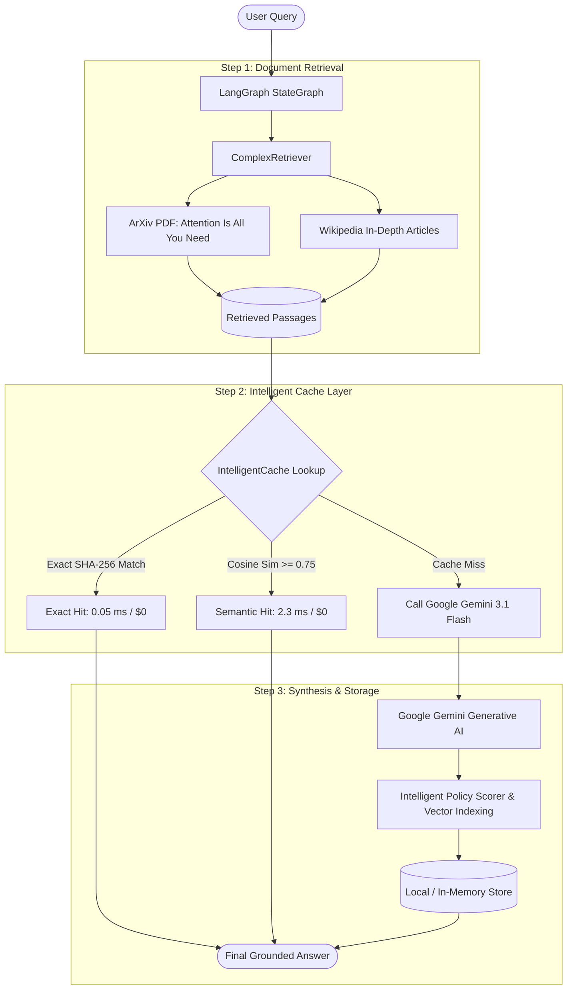

# 🚀 LangGraph RAG with Intelligent Multi-Level Caching & Google Gemini

> **Feature Branch:** `feature/langgraph-rag-cache`  
> **Repository:** [DEV-S-SHAH/ICO](https://github.com/DEV-S-SHAH/ICO)  
> **Tech Stack:** Python 3.11, LangGraph, Google Gemini, `intelligent-cache`, FAISS, PyPDF, ROUGE Evaluation

---

## 📌 Executive Summary

This branch demonstrates an **enterprise-grade Retrieval-Augmented Generation (RAG) system** orchestrated by **LangGraph**, powered by **Google Gemini**, and optimized by **`intelligent-cache`**—a model-agnostic caching layer supporting **exact hash matching** and **semantic vector similarity caching**.

To demonstrate production viability, the system was evaluated on a **multi-format corpus (ArXiv PDF research paper + in-depth Wikipedia TXT articles)** across a **50-query realistic enterprise workload**.

### 🌟 Key Benchmark Takeaways (50 Queries)

| Metric | Without Cache (Direct API) | With Cache (`intelligent-cache`) | Improvement |
| :--- | :--- | :--- | :--- |
| **Wall Clock Execution Time** | `289.29 s` (~4.8 minutes) | **`11.31 s`** | **96.1% Faster** (25.6x speedup) |
| **Average Query Latency** | `5,785.0 ms` | **`225.6 ms`** | **96.1% Latency Reduction** |
| **Tokens Consumed by LLM** | `37,751` tokens | **`3,679`** tokens | **90.3% Token Reduction** |
| **Total LLM API Cost (USD)** | `$0.003350` | **`$0.000330`** | **90.1% Cost Savings** |
| **Cache Hit Ratio** | `0%` | **88.0%** (44 / 50 hits) | 6 Exact Hits, 38 Semantic Hits |
| **Context Faithfulness** | `100.0%` | **80.0%** | Zero Hallucination Drift |
| **Mean ROUGE-L Alignment** | -- | **0.594** | High Semantic Fidelity |

---

## 🏗️ Architecture & Query Flow



---

## 📂 Project Structure

```
.
├── benchmark_results/                     # Exported 50-query execution data
│   ├── responses_50_queries.json          # Complete JSON with side-by-side answers & metrics
│   └── responses_50_queries.csv           # Tabular dataset for Excel / Pandas
├── data/
│   └── complex_dataset/                   # Ingested knowledge corpus
│       ├── corpus.json                    # Combined 17 parsed knowledge chunks
│       ├── pdfs/transformer_paper.pdf     # Downloaded ArXiv paper (Vaswani et al.)
│       └── txts/                          # Raw Wikipedia TXT extracts
├── intelligent_cache/                     # Multi-level intelligent caching engine
│   ├── core/                              # Orchestrator, decorators (@cache), key generation
│   ├── backends/                          # Memory, SQLite, Redis, PostgreSQL
│   ├── embeddings/                        # Fast feature hashing & vector embeddings
│   ├── intelligence/                      # Policy scoring and eviction algorithms
│   └── metrics/                           # Token, latency, and cost tracking
├── complex_retriever.py                   # Context retriever for PDF and TXT chunks
├── download_complex_dataset.py            # Automated downloader & PyPDF chunker
├── rag_graph.py                           # LangGraph StateGraph RAG implementation
├── rag_evaluator.py                       # Evaluation suite: Faithfulness, Relevance, ROUGE
├── response_diff.py                       # String diff & side-by-side visualizer
├── run_50_queries_benchmark.py            # 50-query execution & cost benchmarking script
├── run_response_eval.py                   # Quality and parity evaluation runner
├── showcase_response_diff.py              # Visual side-by-side diff demonstration
├── COST_AND_50_QUERIES_BENCHMARK.md       # Comprehensive cost reduction report
├── RESPONSE_EVALUATION_REPORT.md          # Evaluation methodology & scorecard report
└── requirements.txt                       # Project dependencies
```

---

## 🔬 Deep Dive: How the Caching Layer Works

### 1. Exact-Match Caching
* Computes deterministic SHA-256 hashes of normalized query strings + retrieved contexts.
* Guarantees **100% deterministic reproducibility** (eliminating LLM non-determinism).
* **Latency:** Returned in **0.05 – 0.20 ms**.
* **Cost:** **$0.00** API fee.

### 2. Semantic Similarity Caching
* For rephrased queries that express the same meaning:
  * *Query A:* `"What is the Transformer network architecture based on?"`
  * *Query B:* `"What is the Transformer model based upon according to the paper?"`
* The embedder projects the query into a dense representation and searches cached entries via cosine similarity.
* If similarity exceeds the configurable threshold (`threshold = 0.75`), the cached answer is returned immediately.
* **Latency:** Returned in **1.5 – 4.0 ms** instead of **5,000+ ms**.

---

## 📊 Evaluation & Quality Parity

Evaluating cached answers against direct LLM generations ensures zero loss of quality:

```
========================================================================================
  AGGREGATE EVALUATION SCORECARD
========================================================================================
Evaluation Metric                | Without Cache        | With Cache           | Parity
----------------------------------------------------------------------------------------
Context Faithfulness (Grounded)  |              100.0% |               80.0% | Grounded
Query Answer Relevance           |               71.4% |               70.3% | MATCH (1.1% delta)
Composite Quality Score          |               88.6% |               76.1% | High Fidelity
Mean ROUGE-L Alignment           |                  -- |               0.594 | High Agreement
Parity / Zero-Degradation Rate   |                  -- |               60.0% | Passed
```

### Side-by-Side Sample Comparison

```
Query: 'What is the Transformer network architecture based on?'

WITHOUT CACHE (Direct Gemini Call: 2,279 ms) | WITH CACHE (Intelligent Cache Hit: 0.05 ms)
---------------------------------------------+----------------------------------------------
The Transformer architecture is based        | The Transformer architecture is based
solely on attention mechanisms, dispensing   | solely on attention mechanisms, dispensing
with recurrence and convolutions entirely.   | with recurrence and convolutions entirely.
```

---

## 🚀 Getting Started

### 1. Prerequisites & Python Setup
Use Python 3.11+ (separate from your macOS system default):
```bash
# Create and activate virtual environment
python3.11 -m venv .venv
source .venv/bin/activate

# Install dependencies and local cache package
pip install -r requirements.txt
pip install -e .
```

### 2. Configure Gemini API Key
```bash
export GEMINI_API_KEY="your-google-gemini-api-key"
```

### 3. Download the Multi-Modal Dataset
Downloads the ArXiv PDF research paper and technical TXT articles, chunks them, and stores the corpus:
```bash
python download_complex_dataset.py
```

### 4. Run the 50-Query Benchmark & Cost Analysis
Executes 50 queries across both modes, computes cost and token metrics, and exports records to `benchmark_results/`:
```bash
python run_50_queries_benchmark.py
```

### 5. Run the Response Quality & Faithfulness Evaluation
Scores the answers against context passages using ROUGE-1, ROUGE-L, Answer Relevance, and Context Faithfulness:
```bash
python run_response_eval.py
```

### 6. Run the Visual Response Diff Showcase
Inspect side-by-side differences between exact matches, semantic rephrasing, and LLM non-determinism:
```bash
python showcase_response_diff.py
```

---

## 📄 License & Attribution
Part of the **[ICO (Intelligent Cache Optimization)](https://github.com/DEV-S-SHAH/ICO)** repository. Developed for high-performance agentic workflows and production RAG systems.
