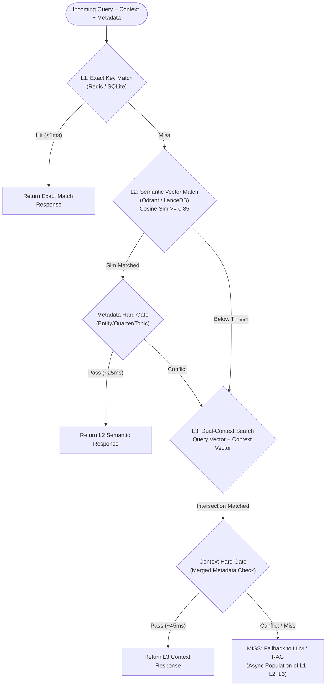

# Architecture & Layer Design

ICO-Cache is an enterprise-grade multi-layer semantic caching engine designed specifically for Large Language Model and RAG workflows. It eliminates redundant generations while mathematically preventing false positives on domain-specific near-miss queries.

---

## 1. The 3-Tier Cache Hierarchy

### Layer 1: Exact Hash Matching (L1)
- **Engine Backends**: Redis (Distributed) or SQLite (Embedded)
- **Key Derivation**: `hash(normalize(query) + canonical_meta_suffix(meta))`
- **Latency**: `< 1ms`
- **Purpose**: Instantly resolves exact repetitive queries. The metadata canonical suffix guarantees that identical query text executed across different entities (e.g. "What was Q1 revenue?" for MSFT vs AAPL) generates separate isolated slots.

### Layer 2: Single-Turn Semantic Matching (L2)
- **Engine Backends**: Qdrant (Distributed) or LanceDB (Embedded)
- **Vector Model**: `BAAI/bge-small-en-v1.5` (FastEmbed local ONNX runtime, 384 dimensions)
- **Latency**: `~15 - 30ms`
- **Matching Rule**: Cosine similarity $\ge 0.85$ subject to the **Metadata Hard Gate**.
- **Purpose**: Catches paraphrased, reordered, or synonymous queries asking the exact same question.

### Layer 3: Dual-Context Vector Matching (L3)
- **Engine Backends**: Qdrant (named vector collections) or LanceDB
- **Vectors**: Dual dense embeddings: $v_{\text{query}}$ (dim 384) + $v_{\text{context}}$ (dim 384)
- **Latency**: `~30 - 50ms`
- **Matching Rule**: Finds documents in the intersection of top query hits and top context hits, gated against both query metadata and context metadata.
- **Purpose**: Resolves conversational and context-dependent queries (e.g., "What were their risk factors?" when the context is "Walmart 2026-Q2").

---

## 2. The Metadata Guardrail (0% False-Hit Baseline)

Standard vector similarity caches fail in high-precision domains because embedding vectors for opposite entities or different financial quarters are cosine-adjacent (e.g., "What was Microsoft's revenue in Q1?" is over 93% cosine similar to "What was Apple's revenue in Q1?").

ICO-Cache enforces hard metadata gating across all three layers:
- **Centralized Extraction**: `extract_fields()` extracts `entity`, `quarter`, and canonicalized `topic` (`revenue`, `R&D`, `margins`, etc.) from incoming queries and contexts.
- **Hard Gate Rule**: If both the incoming request and the cached record contain a value for an extracted field, and those values differ, the hit is **unconditionally blocked** regardless of vector cosine similarity score.
- **Result**: Evaluated on benchmark near-miss sets with 0 / 100 false hits (0% false hit rate).

---

## 3. Observability & Profiling

- **Embedded Mode**: Uses `structlog` to emit structured JSON/key-value logs covering each layer's latency and hit/miss decisions.
- **Distributed Mode**: Integrates with FastAPI request middleware (`X-Request-ID`), OpenTelemetry, and Langfuse tracing.
