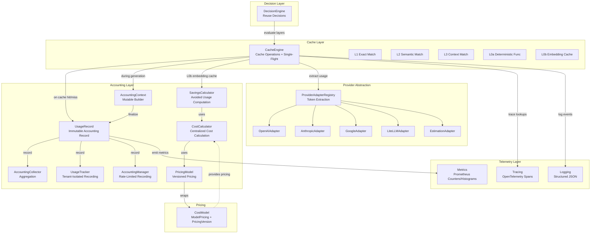
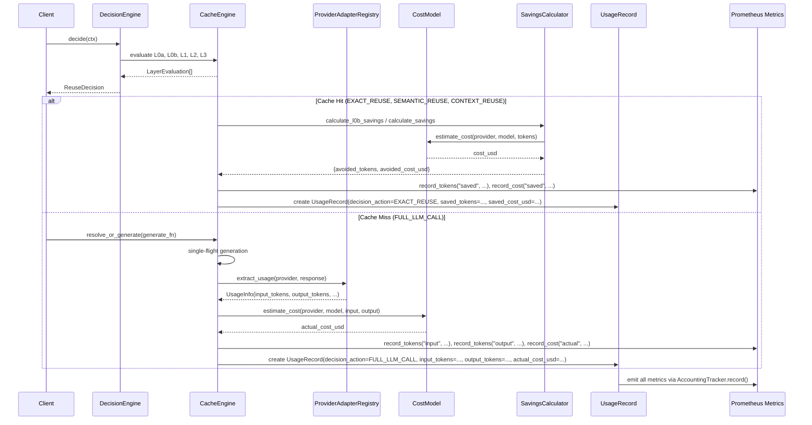

# ICO-Cache Token and Cost Accounting Architecture

## Overview

This document describes the accounting architecture for ICO-Cache Phase 3A.5, covering token usage tracking, cost calculation, savings measurement, and observability integration.

## Component Diagram



## Data Flow

### Request → Decision → Cache Lookup → Generation (if miss) → Accounting Record → Metrics



## Component Boundaries

### DecisionEngine (decision_engine.py)
**Responsibility**: Evaluate reuse opportunities across cache layers
- **Owns**: ReusePolicy, DecisionContext, ReuseDecision, LayerEvaluation, confidence model
- **Does NOT own**: Cost calculation, token extraction, metrics emission
- **Interfaces**: 
  - `decide(ctx: DecisionContext) -> ReuseDecision`
  - `register_layer(CacheLayer)`
- **Dependencies**: CacheEngine (for layer access), MetadataSchema (for hard gates)

### CacheEngine (cache_engine.py)
**Responsibility**: Cache operations (L0a-L3), single-flight generation, token/cost recording
- **Owns**: L1/L2/L3 lookup/write, single-flight state, L0a/L0b caches, embedding computation
- **Does NOT own**: Reuse decisions (delegates to DecisionEngine), pricing logic, metrics definitions
- **Interfaces**:
  - `resolve(query, context, meta, tenant_id, model, provider, prompt_version)`
  - `resolve_or_generate(..., generate_fn)`
  - `get_l1/set_l1`, `get_l2/async_write_l2`, `get_l3/async_write_l3`
  - `get_embedding()` (with L0b cache)
  - `execute_deterministic(fn_name, args)` (L0a)
- **Dependencies**: Embedder, VectorStore, ExactStore, DecisionEngine (for key builders), CostModel, ProviderAdapterRegistry

### Accounting (accounting.py + provider_adapters.py)
**Responsibility**: Canonical usage records, cost calculation, savings computation, tenant-isolated recording

#### UsageRecord (accounting.py)
- **Immutable** dataclass for single request accounting
- **Fields**: Request identity, layer/decision, token usage (input/output/cached/saved), embedding/retrieval/reranker usage, context construction, latency breakdown, cost (actual/saved), confidence, gates, errors
- **Serialization**: `to_dict()` / `from_dict()`
- **Extensibility**: `extra: Dict[str, Any]` for future layers

#### AccountingContext (accounting.py)
- **Mutable** builder for accumulating metrics across phases
- **Finalizes** to immutable `UsageRecord` via `to_record()`

#### AccountingCollector (accounting.py)
- In-memory buffer with running aggregates per tenant/layer/action
- **Production**: Would flush to TSDB (InfluxDB, TimescaleDB) or stream to Kafka

#### ProviderTokenAdapter + Registry (provider_adapters.py)
- **Abstract base**: `extract_usage(response) -> UsageInfo`, `model_fingerprint(model, params) -> str`
- **Concrete adapters**: OpenAI, Anthropic, Google, Together, Fireworks, Groq, Cohere, Ollama, LiteLLM
- **Fallback**: EstimationAdapter (tokenizer or char-based heuristic)
- **Registry**: `ProviderAdapterRegistry.get_adapter(provider)` with prefix matching

#### SavingsCalculator (expected, not yet implemented)
- Computes avoided tokens/cost/latency for cache hits
- Uses baseline estimation heuristic for "what would full LLM call have cost"

#### CostCalculator (expected, not yet implemented)
- Centralized cost calculation using CostModel
- Handles unknown models, fallback pricing

#### PricingModel (expected, not yet implemented)
- Wraps CostModel with versioning support
- Register/get pricing versions for historical reproducibility

#### UsageTracker (expected, not yet implemented)
- Thread-safe, tenant-isolated record storage
- Max records per tenant, TTL trimming, since/limit filters

#### AccountingManager (expected, not yet implemented)
- High-level recording API with rate limiting
- `_scrub_metadata()` for sensitive data removal
- Handler registration for external sinks

### Telemetry (metrics.py, tracing.py, logging.py)
**Responsibility**: Observability emission only - NO business logic

#### Metrics (metrics.py)
- **Prometheus metrics**: Counters, Histograms, Gauges for all accounting dimensions
- **Helper functions**: `record_tokens()`, `record_cost()`, `record_latency()`, `record_llm_call()`, etc.
- **Never raises**: All helpers wrapped in try/except

#### Tracing (tracing.py)
- OpenTelemetry spans for cache lookups, RAG fallback
- Context managers: `trace_cache_lookup()`, `trace_rag_fallback()`

#### Logging (logging.py)
- Structured JSON logging via structlog
- `configure_logging(json_logs=True)`

### Pricing (cost_model.py)
**Responsibility**: Model pricing data and cost estimation
- **ModelPricing**: input/output USD per 1M tokens per provider:model
- **PricingVersion**: version, effective_date, source, description
- **CostModel**: `estimate_cost(provider, model, input_tokens, output_tokens)`, version support
- **Global singleton**: `get_cost_model()`, `set_cost_model()`

## Dependency Rules (No Circular Dependencies)

```
DecisionEngine
    → CacheEngine (for layer evaluation)
    → MetadataSchema (for hard gates)
    ✗ Accounting
    ✗ Telemetry
    ✗ Pricing

CacheEngine
    → DecisionEngine (key builders only)
    → Embedder, VectorStore, ExactStore (backends)
    → CostModel (pricing)
    → ProviderAdapterRegistry (token extraction)
    → Telemetry metrics/tracing (recording only)
    ✗ DecisionEngine internals (ReuseDecision, etc.)

Accounting (accounting.py, provider_adapters.py)
    → CostModel (pricing)
    → Telemetry metrics (recording only)
    ✗ CacheEngine
    ✗ DecisionEngine

Telemetry
    ✗ Accounting
    ✗ CacheEngine
    ✗ DecisionEngine
    ✗ Pricing
    (Pure emission layer)

Pricing (cost_model.py)
    ✗ All other components
    (Pure data + calculation)
```

## Current State vs. Target Architecture

### Implemented ✅
- `CostModel` with versioned pricing (`cost_model.py`)
- `ProviderAdapterRegistry` with 9 provider adapters (`provider_adapters.py`)
- `UsageRecord` / `AccountingContext` / `AccountingCollector` (`accounting.py`)
- Prometheus metrics with accounting helpers (`metrics.py`)
- OpenTelemetry tracing for cache lookups (`tracing.py`)
- DecisionEngine with 5-layer evaluation (`decision_engine.py`)
- CacheEngine with L0a/L0b/L1/L2/L3 + single-flight (`cache_engine.py`)

### Missing / Incomplete ❌
| Component | Expected by Tests | Current State |
|-----------|-------------------|---------------|
| `UsageTracker` | Thread-safe, tenant-isolated recording | ❌ Not implemented |
| `CostCalculator` | Centralized cost calculation | ❌ Not implemented |
| `SavingsCalculator` | Avoided usage computation | ❌ Not implemented |
| `PricingModel` | Versioned pricing wrapper | ❌ Not implemented |
| `AccountingManager` | Rate-limited recording + scrubbing | ❌ Not implemented |
| `AccountingRateLimiter` | Token bucket per tenant | ❌ Not implemented |
| `_scrub_metadata()` | Secret redaction | ❌ Not implemented |
| Global singletons | `get_usage_tracker()`, etc. | ❌ Not implemented |
| `UsageRecord.create()` | Factory method with IDs | ❌ Not implemented |
| `UsageRecord` validation | Non-negative tokens, required tenant | ❌ Not implemented |
| `UsageRecord` fields | `cache_hit`, `llm_called`, `trace_id`, etc. | ❌ Different schema |

### CacheEngine Integration Issues ❌
- Imports non-existent classes from accounting: `TokenUsage`, `LayerAttribution`, `ProviderTokenAdapter`, `SavingsCalculator`, `create_usage_record`, `create_layer_attribution`
- Instantiates `ProviderTokenAdapter()` (ABC, not concrete)
- Uses `_savings_calculator.calculate_l0b_savings()` (doesn't exist)
- Records savings in `_record_cache_hit_savings()` using rough estimation instead of proper `UsageRecord`

## Risks

1. **Schema Drift**: Two different `UsageRecord` designs exist (tests vs. implementation)
2. **Missing Integration**: CacheEngine cannot emit proper accounting records
3. **No Savings Calculation**: L0b embedding cache savings use non-existent `SavingsCalculator`
4. **Security Gap**: No `_scrub_metadata()` - API keys could leak in telemetry
5. **No Rate Limiting**: Accounting events could DoS the system
6. **Test Failures**: All accounting tests will fail with current implementation
7. **Circular Import Risk**: CacheEngine imports from accounting, but accounting should not import from CacheEngine

## Remaining Work

1. **Align accounting.py with test expectations** - Implement `UsageTracker`, `CostCalculator`, `SavingsCalculator`, `PricingModel`, `AccountingManager`, `AccountingRateLimiter`, `_scrub_metadata()`
2. **Fix CacheEngine imports** - Use `ProviderAdapterRegistry` from provider_adapters, not ABC from accounting
3. **Implement SavingsCalculator** - Add `calculate_l0b_savings()` and `calculate_savings()`
4. **Add UsageRecord validation** - Non-negative tokens, required tenant_id, immutable after creation
5. **Add metadata scrubbing** - Redact secrets before recording
6. **Add rate limiting** - Token bucket per tenant in AccountingManager
7. **Export metrics objects** - Add Counter/Histogram objects to `metrics.__all__` for test access
8. **Run accounting tests** - Verify all tests pass