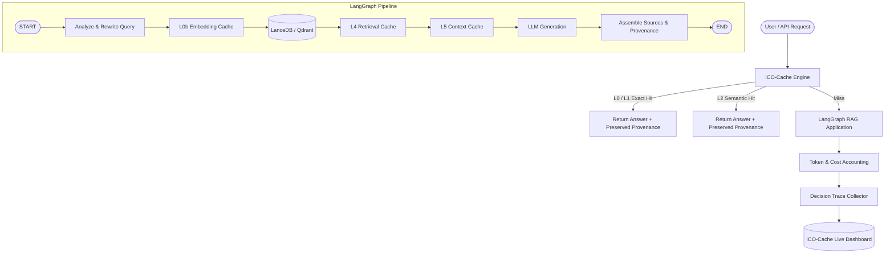

# Real-World RAG Demo with ICO-Cache & Live Dashboard Integration

An end-to-end, production-grade Retrieval-Augmented Generation (RAG) system demonstrating multi-layered semantic caching across **L0 (deterministic)**, **L0b (embeddings)**, **L1 (exact query)**, **L2 (semantic similarity)**, **L4 (retrieval)**, and **L5 (context assembly)** with full source provenance and live telemetry integration into the ICO-Cache Dashboard.

---

## Architecture Overview



---

## Key Features

1. **Real PDF Ingestion**: Sentence-aware chunking, content hashing (`sha256`), and deterministic corpus versioning (`corpus_version`).
2. **Corpus Version Isolation**: When documents are added, modified, or removed, a new corpus version is computed (e.g. `v_f3972c9abe42`). Cached retrieval and context entries from stale corpus versions are automatically invalidated.
3. **Strict Multi-Tenant Isolation**: Cache keys are namespaced by `tenant_id` ensuring complete data and cache isolation across tenants.
4. **Provenance Preservation**: Cached answers never strip citations; source document, page number, and chunk ID are strictly preserved across all cache hits.
5. **Live Dashboard Telemetry**: Emits real-time metrics, accounting records, and decision traces to the Vite/React dashboard on port 3000.

---

## Directory Structure

```text
examples/real-rag-demo/
├── documents/                       # User PDF documents
│   ├── attention_is_all_you_need.pdf
│   ├── retrieval_augmented_generation.pdf
│   └── ico_cache_architecture.pdf
├── data/                            # Persistent stores
│   ├── cache.db                     # SQLite exact store (L1/L4/L5)
│   └── lancedb/                     # LanceDB vector tables
├── src/
│   ├── config.py                    # Environment & runtime configuration
│   ├── ingest.py                    # PDF extraction & corpus versioning
│   ├── embeddings.py                # CachedEmbedder with L0b cache
│   ├── vectorstore.py               # Vector DB abstraction (LanceDB / Qdrant)
│   ├── retriever.py                 # RAGRetriever with L4 retrieval cache
│   ├── prompts.py                   # System prompts & context formatter
│   ├── rag_graph.py                 # Explicit LangGraph RAG workflow
│   ├── api.py                       # FastAPI application & dashboard endpoints
│   └── main.py                      # CLI runner & server launcher
├── scripts/
│   └── generate_sample_papers.py    # Synthetic research paper generator
├── tests/
│   └── test_real_rag.py             # Integration test suite
├── Dockerfile                       # Production container
├── docker-compose.yml               # Multi-container orchestration (API + Dashboard)
├── requirements.txt                 # Python dependencies
├── .env.example                     # Environment template
└── README.md                        # Documentation
```

---

## Quickstart

### 1. Place Documents
Drop any research papers or PDFs into `examples/real-rag-demo/documents/`. Sample papers are pre-generated.

### 2. Configure Environment
```bash
cp examples/real-rag-demo/.env.example examples/real-rag-demo/.env
```

### 3. Run with Docker Compose
```bash
cd examples/real-rag-demo
docker compose up
```

This launches:
- **RAG API & Dashboard Backend**: `http://localhost:8000`
- **ICO-Cache UI Dashboard**: `http://localhost:3000`

---

## Local Development (Without Docker)

### Step 1: Install Dependencies
```bash
pip install -r examples/real-rag-demo/requirements.txt
```

### Step 2: Ingest Documents
```bash
python examples/real-rag-demo/src/main.py --ingest
```

### Step 3: Run RAG API
```bash
python examples/real-rag-demo/src/main.py --port 8000
```

### Step 4: Start Dashboard
In a separate terminal:
```bash
cd apps/dashboard
npm install
npm run dev
```
Open [http://localhost:3000](http://localhost:3000) to view real-time metrics.

---

## Example Queries via cURL

### Cold Query (Cache Miss)
```bash
curl -X POST http://localhost:8000/rag/query \
  -H "Content-Type: application/json" \
  -d '{"query": "What is the primary contribution of the Transformer architecture?"}'
```

### Repeated Query (L1 Exact Match Hit)
```bash
curl -X POST http://localhost:8000/rag/query \
  -H "Content-Type: application/json" \
  -d '{"query": "What is the primary contribution of the Transformer architecture?"}'
```
Response:
```json
{
  "answer": "...",
  "sources": [
    {
      "document": "attention_is_all_you_need.pdf",
      "page": 1,
      "chunk_id": "c71a396baea7_p1_c1"
    }
  ],
  "request_id": "req_84bb64bcae",
  "corpus_version": "v_f3972c9abe42",
  "cache": {
    "hit": true,
    "layer": "L1",
    "tokens_saved": 520,
    "latency_saved_ms": 450.0
  },
  "latency_ms": 0.4
}
```

---

## Running Tests & Benchmarks

```bash
# Run real RAG test suite
python -m pytest examples/real-rag-demo/tests/ -v

# Run comparative validation benchmark (Baseline vs ICO-Cache)
python scripts/validate_real_rag.py
```
